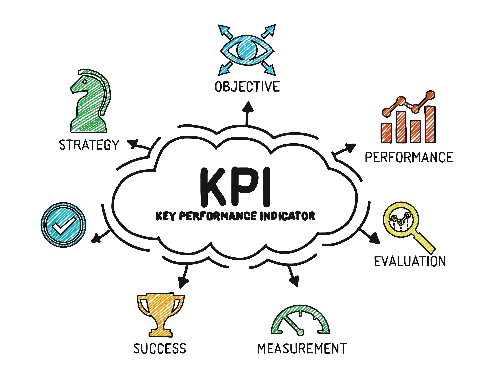
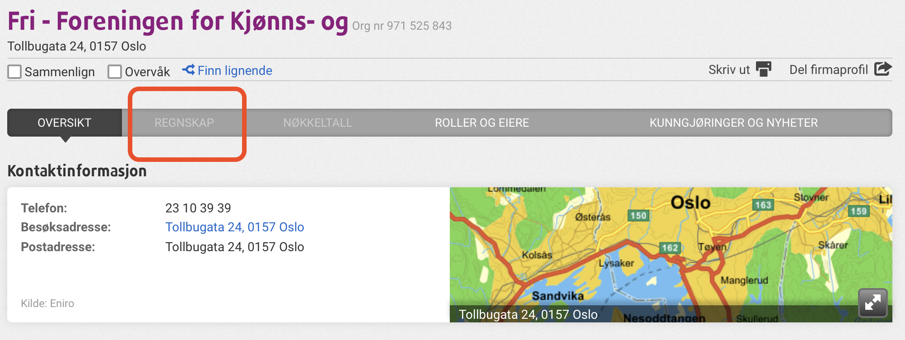
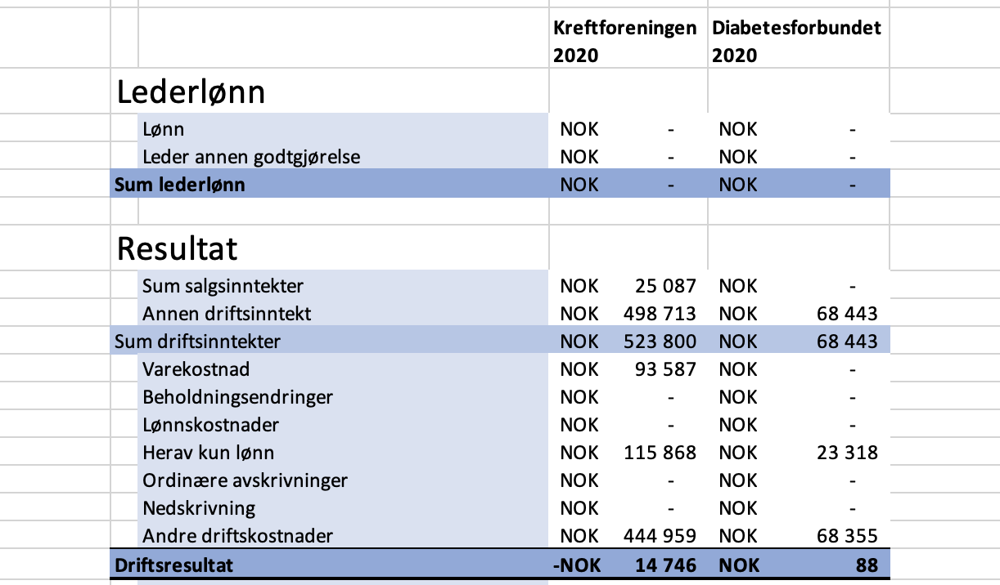
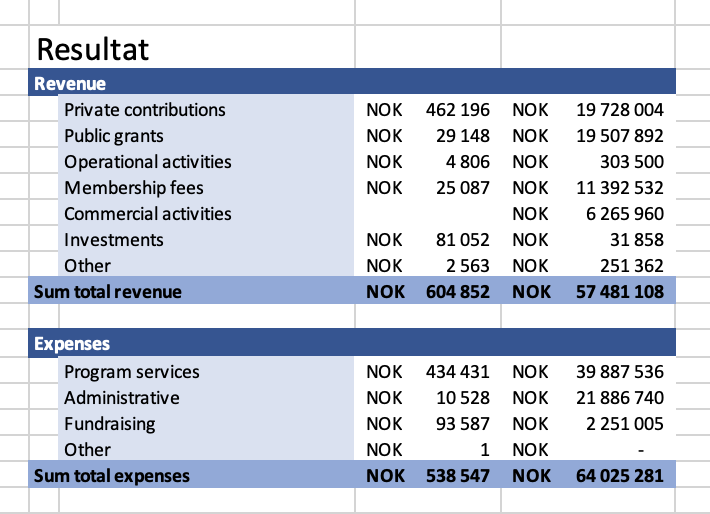
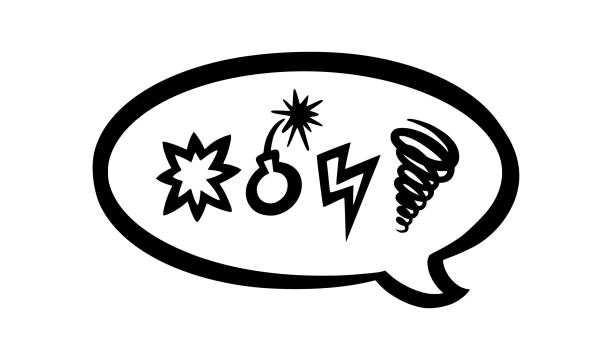

```{r setup, include=FALSE}
knitr::opts_chunk$set(echo = FALSE)

```


## <br> OPX and their goal
- Develop solutions for socially responsible investment strategies
- Increase cash flow to charitable purposes <br>

```{r, out.height="128px", out.width="568px", fig.align='center'}

```


## <br> How to assess financial performance?
- Data collection 
- Key Performance Indicators <br>

```{r, out.height="268px", out.width="350px", fig.align='center'}


```


## {data-background="Images/brainstorming2.png" data-background-size=cover}


## <br> How to harvest and analyze the data?
- OPX wanted data collection to be automated <br> 
- Webscraping? <br> 
No: Different HTML and PDF structures
- A code that could read PDF documents? <br> 
Perhaps: Financial statements as text tables and as images


## <br> Exploring three options
1. Reading PDFs <br>
Issue: Not always published as text
2. Webscraping from Proff.no <br>
Issue: Proff.no does not allow (automated) webscraping
3. Webscraping the Brønnøysund registry <br>
Issue: No API access, and access costs ~ NOK 500 000

## <br> Workarounds... 
- Proff.no: Download the webpage as HTML document?
- Brønnøysund: Received XML files from Statistics Norway

## <br> ... and why they did not work
- XML not a viable long term solution for OPX 
- Incomplete financial reporting from NGOs -- no legal obligations
- Proff.no vs. OPX: Different accounting items used <br> <br> <br>

```{r, out.height="188", out.width="500", fig.align='center'}


```

## Items Brønnøysund
```{r, out.height="470", out.width="800", fig.align='center'}


```

## Items OPX
```{r, out.height="514", out.width="710", fig.align='center'}


```

---- 
```{r, out.height="360", out.width="612", fig.align='center'}


```

## <br> Which led us to scrapping the scraping <br>
- Found useful KPIs
- Created an interactive dashboard

## <br> Data collection & data description
- Proff.no: Downloaded HTML documents <br>
Used to create visualizations
- OPX: From their webpage <br>
Used to create KPIs and test our codes

# Dashboard

## <br> <br> <br> <br> torbjornso.shinyapps.io/NGOanalysis/

# Limitations and steps forward

## <iframe width="1280" height="720" src="Images/henrik.mp4" align="middle" frameborder="0" allowfullscreen></iframe>

## {data-background="Images/upbeat_and_happy.png" data-background-size=cover}

## <br> Our experience
- Unsolvable case due to lack of accessible and relevant data
- Hard to create credible KPIs due to limited knowledge of economics and the NGO sector
- **Insight into real-life work challenges - the clash between what is desired and what is possible**

## <br> <br> <br> The End
**Thank you for this opportunity!** <br> <br> <br>
- Questions?
