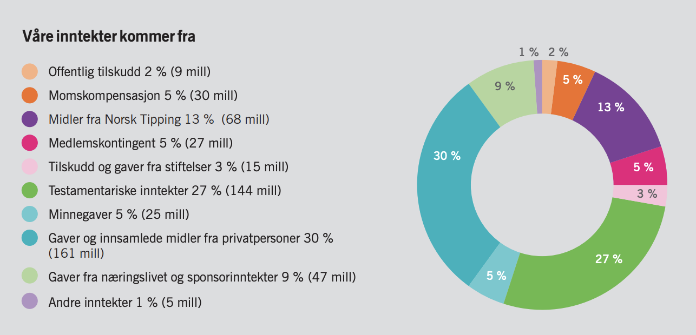

```{r Setup, include=FALSE}
knitr::opts_chunk$set(echo = TRUE, warning = FALSE, error = FALSE, message = FALSE, out.width = "100%")
```

```{r libraries, include=FALSE}
library(tidyverse)
library(janitor)
library(rvest)
library(MetBrewer)
```

```{r line, include=FALSE}
line <- "***"
```

```{r data_and_functions, include=FALSE}
# Data reading =================================================================

## Function to read html file --------------------------------------------------
read_proff <- function(file, start, end) {
  # Specifying encoding to deal with occasional errors
  read_html(file, encoding = "UTF-8") |>
    html_node("#inner-frame") |>
    html_table() |>
    # removing empty column, using all_of(argument)
    select(
      REGNSKAPSPERIODE:all_of(start)
    ) |>
    # removing white space
    mutate(
      REGNSKAPSPERIODE = str_squish(REGNSKAPSPERIODE)
    ) |>
    # removing duplicate table sometimes created by read_html()
    filter(
      !row_number() > 176
    ) |>
    # removing duplicate rows
    filter(
      !grepl("Lukk", REGNSKAPSPERIODE)
    ) |>
    # tidying data using pivot_longer() and all_of(argument)
    pivot_longer(
      all_of(end):all_of(start),
      names_to = "year"
    ) |>
    mutate(
      # changing to real NAs
      value = na_if(value, "-"),
      # turning years into numbers
      year = as.integer(year),
      # creating a currency code column and turning current currency codes into
      # NAs
      valutakode = ifelse(REGNSKAPSPERIODE == "Valutakode", value, NA)
    ) |>
    # filling the currency column
    fill(
      valutakode,
      .direction = "updown"
    ) |>
    # removing dates and redundant currency
    filter(
      REGNSKAPSPERIODE != "Sluttdato" & REGNSKAPSPERIODE != "Startdato" &
        REGNSKAPSPERIODE != "Valutakode"
    ) |>
    mutate(
      # removing white space in numbers
      value = str_replace_all(value, "\\s", ""),
      # turning numbers into true numbers
      value = as.numeric(value),
      # removing values that are years
      value = ifelse(grepl("i hele 1000", REGNSKAPSPERIODE), NA, value)
    ) |>
    # removing any remaining duplicate rows
    distinct() |>
    # pivoting to create 'tidy' variables
    pivot_wider(
      names_from = REGNSKAPSPERIODE, values_from = value
    ) |>
    # tidying names
    clean_names() |>
    # removing headings from the table
    select(
      -lederlonn_i_hele_1000,
      -resultatregnskap_i_hele_1000,
      -balanseregnskap_i_hele_1000
    ) |>
    # making it clear what lonn refers to
    rename(
      lederlonn = lonn
    ) |>
    # Creating new variables for plots
    mutate(
      annual_profit = ifelse(arsresultat >= 0, TRUE, FALSE),
      balance_positive = ifelse(sum_egenkapital_og_gjeld >= 0, TRUE, FALSE)
    ) |>
    # arranging by year for practical display
    arrange(desc(year))
}

## Creating df------------------------------------------------------------------
kreftforeningen <- read_proff("Data/Kreftforeningen.html", "2002", "2021")

## scale_fill_green ------------------------------------------------------------
# Function with slightly nicer colours than default; ensuring uniformity; +
# ensuring positive values are always green through a test for the presence of
# FALSE values
scale_fill_green <- function(variable) {
  scale_fill_met_d("Tsimshian",
    direction = ifelse(
      mean(variable,
        na.rm = TRUE
      ) == 1, -1, 1
    )
  )
}
```


<!--# Starting report on second page to avoid a tiny text portion below the toc-->
\newpage
# Introduction

This report describes the group's approach to the problem statement and
our findings. First, the problem statement is presented, then the
brainstorming and data collection processes are elaborated, before data
description and findings are presented. Lastly, limitations and steps
forward, as well as a summary of our experience.


## Problem statement

The project chosen for our group was Oslo Philanthropic Exchange (OPX), 
a startup working to develop solutions to assist individuals and 
organizations wanting to donate to charities and designing a socially 
responsible investment strategy.  Their main goal is to increase cash 
flow from private to charitable purposes. Therefore, the donor's trust 
in the charities’ abilities to carry out their promises is significant. 
 
To do this, data from charities need to be collected. OPX’s current 
challenge is the data collection, which must be collected manually today
since the data is unstructured. Therefore, they wanted a way to automate 
the data collection, using web scraping.
 
Additionally, by creating KPIs (Key Performance Indicator), OPX can use 
them to benchmark the relationship between financial assets and emergency 
relief obligations. 

It is important to solve this problem because:

1. Automating the data collection will streamline the work of OPX 
and create more transparency which enhances trust in charities.

2. Creating KPI(s) is important for the organization’s performance 
management, to influence the objective, and to foster growth.

The scope of the problem statement was narrowed down to the Nordic 
countries as a starting point. 


# Brainstorming

Our brainstorming process for this case was characterized by several
surprises and turns in the direction of the solution. As we dug deeper
into the solution opportunities, we were also met by new obstacles that
forced us to change course. In particular, there were four turning
points. Therefore, we have decided to divide the brainstorming into
three phases.

## Phase 1: How to harvest and analyze the data? {.smaller}

OPX wanted us to harvest the organizations' financial data from the web.
During the first stage of brainstorming, we wanted to find a simple and
automated way to do so.

We discussed creating a webcrawler that could collect data across
different websites, but quickly decided that this would be too
difficult, and that it would only work with selected organizations. The
suggested solution was to create a code that could read PDF documents
that OPX downloaded themselves. Our code would analyze and organize the
uploaded data from the PDF documents.

However, different organizations publish financial data in different
ways in their yearly reports -- some financial statements were included
as tables, some as pictures, etc. This led us to phase 2.

<!-- # All images need captions-->

```{r, echo=FALSE, out.width="70%"}
knitr::include_graphics("Images/lagret_tekst.png") # må finne ut av hvordan vi deler disse bildene

# inkluder en med årsregnskapet som pdf her
```


## Phase 2: Exploring solutions {.smaller}

At this stage, we wanted to explore alternatives to analyzing PDF
documents. We discussed how to do so, and concluded that we had three
options:

- Financial statements in annual report PDF documents. 
- Webscrape Proff.no for financial statements. 
- Webscrape the Brønnøysund registry.

We divided the task among ourselves to explore whether these solutions
were feasible or not. The first option of using PDF documents still had
the issue of financial statements not always being published as text.
Also, we quickly found that Proff.no disallowed webscraping on their
website. The Brønnøysund registry does offer API access to all the financial statements, but we discovered that access to costs NOK 480,000.

We started to look at workarounds for this problem. It would still be
possible to download Proff.no HTML websites manually for each
organization. We did receive some XML files from Statistics Norway, but using these is ultimately not a viable solution for OPX.

The Brønnøysund registry and Proff.no had different divisions of
accounting items than the ones OPX wanted. We found that we needed to
create an item path from the webpage items to the OPX items, and we
attempted to do so in Excel at first, so that we later could code this
into R. While doing so, we realized that it would be practically
impossible to extract the correct sums for the OPX accounting items from
the Brønnøysund items. This was e.g. because OPX had split the operating
income into public and private contributions, while the Brønnøysund
registry and Proff.no had not.

```{r, echo=FALSE, out.width="70%"}

```


```{r, echo=FALSE, out.width="100%"}
knitr::include_graphics("Images/regnskapssti.png")
```

When also discovering that not all organizations publish their financial
statements, and certainly not for every year, we decided to give up on
collecting financial data for OPX. This is when we moved on to the third
and final stage.

## Phase 3: Scrapping the scraping {.smaller}

The OPX case requested two tasks -- webscrape financial data, and create
KPIs. During phase three, we scrapped all ideas and progress from the
first two stages, and focused on creating KPIs.

We divided amongst ourselves that some would find useful KPIs from best
practices, while someone else found the accounting items in the OPX
structure that were needed in the calculations. Then, we coded the KPI
calculations into R.

In order to create a somewhat more challenging task for ourselves, we
also decided to create a shiny app that OPX could use, which would
display the KPIs as well as financial trends for the selected
organization. To use this, OPX needs to gather the financial data
themselves, then upload this into the shiny app as a x document

# Data collection

We wanted to use webscraping to collect the data, so that we could have
automated the data input process. As described, we explored different
potential solutions. We experimented on coding such that data could have
been imported from XML files. However, once we realized that the
financial data was of little ¨use, this experimentation stopped.

As we entered the third phase of brainstorming, we still needed some
example data so that we could test our KPI codes. For this, we used the
financial data that OPX had already gathered from different
organizations and organized into useful accounting items.

We copied these financial statements manually into an Excel document.
Perhaps a "simple" solution, however our code requires OPX to import
both an Excel document themselves into shiny, as well as a HTML document
from Proff.no.

If OPX wishes to develop our solution, we recommend that they purchase
API access from the Brønnøysund registry and/or Proff.no. They also need
to create e.g. a simple SQL database with its own data that can be used
by R.

# Data description


<!--Legg inn bilder her-->

<!-- # Legger inn tre grafer som viser manglende data i Proffs årsregnskap-->

```{r arsresultat, echo=FALSE, out.width="70%", fig.align='center', fig.asp=0.5, fig.cap="Net income/loss data for the Norwegian Cancer Society from Proff.no"}
kreftforeningen |>
  rename(
    Year = year,
    `Net income` = arsresultat,
    `Net positive` = annual_profit
  ) |>
  ggplot(aes(Year, `Net income`, fill = `Net positive`)) +
  geom_col() +
  scale_y_continuous(labels = scales::label_dollar(prefix = "NOK ")) +
  scale_fill_green(kreftforeningen$annual_profit) +
  labs(
    x = "", y = ""
  ) +
  theme_light() +
  theme(legend.position = "none")
```

```{r egenkapital, echo=FALSE, out.width="70%", fig.align='center', fig.asp=0.5, fig.cap="Total equity/liabilities data for the Norwegian Cancer Society from Proff.no"}
kreftforeningen |>
  ggplot(aes(year, sum_egenkapital_og_gjeld, fill = balance_positive)) +
  geom_col() +
  scale_y_continuous(labels = scales::label_dollar(prefix = "NOK ")) +
  scale_fill_green(kreftforeningen$balance_positive) +
  labs(
    x = "", y = "", title = "Total equity/liabilities (in thousands)"
  ) +
  theme_light() +
  theme(legend.position = "none")
```

```{r CEO, echo=FALSE, out.width="70%", fig.align='center', fig.asp=0.618, fig.cap="CEO compensation data for the Norwegian Cancer Society from Proff.no"}
kreftforeningen |>
  # preparing for pivoting
  select(
    year, lederlonn, leder_annen_godtgjorelse
  ) |>
  # Compensation in ordinary numbers
  mutate(
    lederlonn = lederlonn * 1000,
    leder_annen_godtgjorelse = leder_annen_godtgjorelse * 1000
  ) |>
  # renaming for the purposes of the plot
  rename(
    Year = year,
    Salary = lederlonn,
    `Other compensation` = leder_annen_godtgjorelse
  ) |>
  # pivoting to join the two values to use fill
  pivot_longer(c(Salary, `Other compensation`), names_to = "Compensation") |>
  ggplot(aes(Year, value, fill = Compensation)) +
  geom_col() +
  # using currency scale function to add correct currency code or ?
  scale_y_continuous(labels = scales::label_dollar(prefix = "NOK ")) +
  # pretty colours
  scale_fill_met_d("Hokusai2", direction = -1) +
  labs(
    x = "", y = "", title = "CEO compensation"
  ) +
  theme_light() +
  theme(legend.position = "bottom")
```

# Findings

## KPIs and visualisations

### Key Performance Indicators

On the basis of such data as we could gather we developed five potential KPIs:

- **Fundraising ROI**:
  - A basic measure of the return on investment of direct fundraising expenses: 
  
  $$\frac{\text{private contributions} + \text{membership fees} - \text{fundraising expenses}}{\text{fundraising expenses}} \times 100$$
  
This KPI is not a true measure of fundraising ROI, as it only includes (as we understand OPX's data) the direct fundraising expenses, and does not include major indirect expenses such as salary costs.

***

- **Liquid assets/obligations**:
  - A measure of the relationship between the organisation's liquid assets and its obligations:
  
  $$\frac{\text{private contributions} + \text{investment income} + \text{cash in bank and cash equivalents}}{\text{short term grants payable} + \text{revocable endowments} + \text{long term grants payable}} \times 100$$
  
This KPI was suggested by OPX.

***

- **Private donations growth**:
  - A calculation of the percentage change in private contributions based on the two most recent years:
  
  $$\frac{\text{private contributions}_2 - \text{private contributions}_1}{\text{private contributions}_1}\times 100$$

***

- **Public grants growth**:
  - A calculation of the percentage change in public grants received based on the two most recent years:
  
$$\frac{\text{public grants}_2 - \text{public grants}_1}{\text{public grants}_1} \times 100$$

***

- **Private/public proportion**:
  - Calculates the percentage of non-commercial or activity-based income that is derived from private contributions and membership fees as opposed to public grants:
  
$$\frac{\text{private contributions} + \text{membership fees}}{\text{public grants} + \text{private contributions} + \text{membership fees}} \times 100$$

This KPI may say something about the NGO's sources of funding. There are prima facie no specific desirable funding mix, but this measure may be of interest to some donors.

***

### Visualisations

The dashboard includes five plots, three based on data from Proff.no and two based on data from the Excel sheet.

-   **Net income/loss**: Based on the entry *Årsresultat* in the Proff.no data.
-   **Total equity/liabilities**: Based on the entry *Sum egenkapital og gjeld* in the Proff.no data.
-   **Revenues**: Based on the category *Revenue* in the Excel sheet.
-   **Expenses**: Based on the category *Expenses* in the Excel sheet.
-   **CEO compensation**: Based on the category *Lederlønn* in the Proff.no data. Not in thousands. Includes the entries *Lønn* and *Leder annen godtgjørelse*.
    -   This appears to increasingly be treated as a necessary measure of transparency and performance, but the values should normally be evaluated in the context of the size of the NGO and the sector(s) within which it operates.

The plots based on data from Proff.no often demonstrate surprising lacunae, but it difficult to know where they originate -- NGO reporting, Brønnøysund, or Proff.no.

## The Dashboard

One of the outputs we have created is an example dashboard that calculates some KPIs and creates a few visualisations based on user-uploaded data from Proff.no and the Excel template we developed. The basic layout and structure of the dashboard were created using Flexdashboard, whilst most of the logic 'under the hood' was created using Shiny. Additionally, the dashboard provides the user with the option of downloading a pdf version of the analysis, using a parameterised R Markdown document.

As the dashboard uses a fair number of packages, it uses the pacman package to ensure they are installed, to avoid the user being confronted with messages about missing packages:

`r if (knitr::is_latex_output()) line`

```{r dashboard_packages, eval=FALSE}
if (!require("pacman")) install.packages("pacman")
library(pacman)
p_load(
  shiny, tidyverse, scales, rvest, janitor, plotly, readxl,
  flexdashboard, MetBrewer, fontawesome, htmltools
)
```

`r if (knitr::is_latex_output()) line`

The dashboard consists of three main parts: a sidebar, the dashboard proper, and a 'Details' tab that provides basic information about the KPIs and plots.

### The Sidebar

The sidebar includes file upload boxes for Excel and html files, numeric input boxes in which the user can input the years covered by the Proff.no data, and an 'Analyse' button which is connected to two Shiny `observe() |> bindEvent()` structures, ensuring that most of the code is not executed until the user has finished entering data. (Though both structures await the same button click, the division was necessary to remain within R's 10,000 byte limit.)

`r if (knitr::is_latex_output()) line`

```{r dashboard_sidebar, eval=FALSE}
# HTML upload
fileInput("html", label = "Upload html file", accept = ".html")

# Year inputs
numericInput("start", label = "Start", value = 2002)
numericInput("end", label = "End", value = 2021)

# Excel upload
fileInput("excel", "Upload Excel file", accept = ".xlsx")

# Button
actionButton("click", "Analyse")
```

`r if (knitr::is_latex_output()) line`

Flexdashboard and Shiny do not fail particularly gracefully, so in addition to the information to the user and the information about file types provided to the browser, the Shiny logic executed on the button press includes some basic validations using `validate()` and `tools::file_ext()` which output error messages if the wrong file has been uploaded.^[Note that the `accept` argument is not obeyed by the RStudio viewer, but most ordinary browsers enforce the instruction.]

If the validation is successful the files are read using the functions developed for this purpose, which conduct further testing, outputting error messages using `validate()`. Using these functions, the actual creation of data frames takes place in two stages for each file, partially for data testing and partially to create subsidiary data frames used by some functions.^[The data reading code is included as an appendix because of its length.]

### The dashboard proper

```{r, out.width="50%", fig.cap="The main dashboard page", fig.align='center', echo=FALSE}
knitr::include_graphics("Images/Dashboard_page_1.png")
```
#### Key Performance Indicators

The main section of the dashboard has a row-based layout, with a top row containing five 'value boxes' displaying KPIs derived from data in the Excel sheet, calculated and formatted in separate reactive functions. As Flexdashboard fails particularly gracelessly when errors occur with the value boxes, each function relies on some basic checks carried out by separate functions created for this purpose. In the case of both this is a simple function that checks if any of the numeric columns contain characters (in which case the data frame is probably hopelessly corrupted):

`r if (knitr::is_latex_output()) line`
```{r dashboard_datatest, eval=FALSE}
datatest <- reactive({
    if (mean(unlist(lapply(exceldata(), is.character))) != 0) {
      TRUE
    } else {
      FALSE
    }
  })
```

`r if (knitr::is_latex_output()) line`

If there are any characters, the calculation outputs `NA`, otherwise it carries out the calculation. One example:

`r if (knitr::is_latex_output()) line`
```{r dashboard_KPI_calculation, eval=FALSE}
# Creating Fundraising ROI value
KPI_fundraising_num <- reactive({
  # testing for data quality, returning NA if bad
  if (datatest() == TRUE) {
    NA
  } else {
    exceldata() |>
      # most recent year
      filter(year == max(year)) |>
      transmute(
        # Calculating the value as a percentage; removing all other
        KPI_fundraising_num =
          (sum(revenue_private_contributions,
            revenue_membership_fees,
            na.rm = TRUE
          ) - expenses_fundraising) /
            expenses_fundraising * 100
      ) |>
      # just want the single number
      pull() |>
      first()
  }
})
```

`r if (knitr::is_latex_output()) line`

The value box then also relies on a function that converts the number into a percentage string, checking in the process if the number is `NA` or `Inf` (indicating a division by zero, and thus either a data problem or data not suited to this calculation).
```{r dashboard_KPI_string, eval=FALSE}
# Function to turn KPI values into NA or percentage string
KPI_to_string <- function(variable) {
  # Returning NA if the KPI is Inf (division by zero) or NA, to avoid
  # layout-breaking errors, otherwise formatting. (The check for NA is needed to
  # avoid passing an NA to subsequent operations.)
  if (is.na(variable)) {
    NA
  } else if (variable == Inf) {
    NA
  } else {
    # Shortening (lengthening) the value, adding %
    str_c(format(variable, digits = 3), "%")
  }
}
```

`r if (knitr::is_latex_output()) line`

In the case of some value boxes, such as the Fundraising ROI one, the function includes logic that changes the colour and icon of the box based on the calculated number. The levels are based on some cursory examination of expected levels of Fundraising ROI, but may of course be changed if the dashboard is developed further.
```{r dashboard_valuebox, eval=FALSE}
# Creating value box for fundraising ROI
output$KPI_box_fundraising <- renderValueBox({
  valueBox(
    value = KPI_to_string(KPI_fundraising_num()),
    caption = "Fundraising ROI",
    # Colour depends on value
    color = if (is.na(KPI_fundraising_num())) {
      "primary"
    } else if (KPI_fundraising_num() < 100) {
      "danger"
    } else if (KPI_fundraising_num() < 200) {
      "warning"
    } else {
      "success"
    },
    # icon depends on whether or not the value is NA
    icon = if (is.na(KPI_fundraising_num())) {
      "fa-solid fa-circle-xmark"
    } else {
      "fas fa-donate"
    }
  )
})
```

`r if (knitr::is_latex_output()) line`

All the boxes also include, as mentioned, a Fontawesome icon, fetched using the fontawesome package, as Flexdashboard relies on the unsupported version 3 of Fontawesome, whilst fontawesome used the still-supported version 5 when coding began, and has just been updated to use version 6.1.1. All boxes use the theme colour 'primary' and the icon 'fa-solid fa-circle-xmark' if the value is NA.
```{r dashboard_fontawesome, eval=FALSE}
# Using fontawesome for more up-to-date (and currently supported) fontawesome
# icons
htmltools::tagList(fontawesome::fa_html_dependency())
```

#### Plots

Below the row of KPI boxes, the dashboard contains three more rows containing five plots, three based on Proff.no data and two based on Excel data. The html-based plots include a basic test of whether the necessary data are available, as some or all may sometimes be missing, printing a 'no information' plot using a separate function if the data is missing.
```{r html_datatest, eval=FALSE}
# testing for the presence of data
if (sum(!is.na(htmldata()$arsresultat)) == 0) {
  # Printing 'no information' plot if no data
  no_information()
} else {
  ggplot() # create plot
}
```

`r if (knitr::is_latex_output()) line`

The 'no information' plot is an essentially empty plot displaying a notice to the user, and is created through a function that passes label information into a more general blank plot function:
```{r dashboard_no_information, eval=FALSE}
## no_information plot ---------------------------------------------------------
# Function to print a 'no information' plot, if necessary
no_information <- function() {
  empty_plot("No information available")
}

## empty_plot-------------------------------------------------------------------
# Function to print an empty plot with a supplied message
empty_plot <- function(warning) {
  ggplot() +
    # text geom with a space to create the plot, but otherwise show nothing
    geom_text(aes(0, 0, label = " ")) +
    # as blank a slate as possible
    theme_void() +
    annotate(
      "text",
      label = warning,
      # Using the same palette as the other non-profit/loss plots
      x = 0, y = 0, size = 8, colour = met.brewer("Hokusai2", 1)
    )
}
```

`r if (knitr::is_latex_output()) line`

The top row contains two plots showing the annual result and balance data for the years covered by Proff.no. These are fairly simple bar plots, including a `fill` parameter colouring the bars depending on whether the numbers are positive or negative. They do, however, rely on two simple additional functions, one which checks whether the currency code is uniform across the years, and, if so, using it for the y scale, or, otherwise, uses a question mark instead of a currency code, both using `scales::label_dollar()`.

`r if (knitr::is_latex_output()) line`
```{r dashboard_currency, eval=FALSE}
# Reactive function to check for currency and use currency code or ?
currency_scale <- reactive({
  scale_y_continuous(
    # Checking for uniform currency code
    labels = ifelse(length(unique(html_currency()$valutakode)) == 1,
      # Using the currency code if uniform
      label_dollar(prefix = str_c(unique(html_currency()$valutakode), " ")),
      # alternative prefix if multiple currencies in the data
      label_dollar(prefix = "? ")
    )
  )
})
```

`r if (knitr::is_latex_output()) line`

A second function is used for the `fill` parameter in order to (1) ensure that positive numbers are always green, irrespective of the presence of negative numbers, and vice versa, and (2) to use slightly nicer colours than the default ggplot2 ones, making use of the 'Tsimshian' palette from Blake R. Mills' creative [MetBrewer](https://github.com/BlakeRMills/MetBrewer) package.

`r if (knitr::is_latex_output()) line`

```{r}
## scale_fill_green ------------------------------------------------------------
# Function with slightly nicer colours than default; ensuring uniformity; +
# ensuring positive values are always green through a test for the presence of
# FALSE values
scale_fill_green <- function(variable) {
  scale_fill_met_d("Tsimshian",
    direction = ifelse(
      mean(variable,
        na.rm = TRUE
      ) == 1, -1, 1
    )
  )
}
```

`r if (knitr::is_latex_output()) line`

The plots are converted to plotly using `ggplotly()`. As subtitles and captions do not survive the conversion, a separate function outputs a plotly annotation if the data contains multiple currency codes:

`r if (knitr::is_latex_output()) line`
```{r dashboard_plotly, eval=FALSE}
# Creating plotly output
output$arsresultat_plotly <- renderPlotly(
  ggplotly(arsresultat_plot()) |>
    ## ggplot subtitles and captions are lost when using ggplotly(), a
    ## currency warning caption is therefore added in plotly, if needed, using
    ## a separate function
    layout(
      annotations =
        plotly_caption()
    )
)

# Reactive function to create plotly caption (ggplot captions and subtitles
# are lost in the conversion) (shamelessly stolen from the Internet, with
# minor modifications).
# Checks for uniform currency code and prints a warning
# if there are multiple currency codes.
plotly_caption <- reactive({
  list(
    x = 1, y = -0.1,
    text = ifelse(length(unique(html_currency()$valutakode)) == 1,
      "", "Note: not all values are denominated in the same currency"
    ),
    showarrow = F, xref = "paper", yref = "paper",
    xanchor = "right", yanchor = "auto", xshift = 0, yshift = 0,
    font = list(size = 11)
  )
})
```

`r if (knitr::is_latex_output()) line`

Below these plots are two plots based on Excel data. These both use the same check for data quality as the value box, outputting a 'bad data' plot if the data are bad using a function that passes label information to the `empty_plot()` function:
```{r dashboard_excel_datatest, eval=FALSE}
## bad_data plot ---------------------------------------------------------------
# Function to print a 'bad data' plot, if necessary
bad_data <- function() {
  empty_plot("Something is wrong\nwith the Excel data.")
}
```

`r if (knitr::is_latex_output()) line`

They also make use of a function that checks that any data are available in the respective category:

`r if (knitr::is_latex_output()) line`
```{r dashboard_zero_check, eval=FALSE}
## Excel zero test------------------------------------------------------------
excel_zero_check <- function(type) {
  excel_test() |>
    # Choosing the specified category (i.e. Revenue or Expenses)
    filter(
      category == as.character(all_of(type))
    ) |>
    # Calculating if there are any zeroes
    summarise(
      zero = sum(value != 0, na.rm = TRUE)
    ) |>
    # just the single number
    pull()
}
```

`r if (knitr::is_latex_output()) line`

Through a function that passes information to the `empty_plot()` function the user receives a warning if an entire category consists of only zeroes or NA:

`r if (knitr::is_latex_output()) line`
```{r}
## zero_data_plot --------------------------------------------------------------
zero_data <- function() {
  empty_plot(
    "All values are zero or missing.
    This is unusual and may
    indicate a data problem.")
}
```

`r if (knitr::is_latex_output()) line`

Both plots feature a certain amount of data transformation, including renaming the variables, so that the legend includes appropriate information; pivoting - in order to use the `fill` aesthetic; and ordering of the categories, so that they occur in an appropriate order. Excel data are presumed to be supplied in NOK.
```{r dashboard_excelplot, eval=FALSE}
exceldata() |>
  # Renaming for the purposes of the plot + dropping other variables
  transmute(
    Year = as.factor(year),
    `Private contributions` = revenue_private_contributions,
    `Membership fees` = revenue_membership_fees,
    `Public grants` = revenue_public_grants,
    Investments = revenue_investments,
    `Operational activities` = revenue_operational_activities,
    `Commercial activities` = revenue_commercial_activities,
    Other = revenue_other
  ) |>
  # Pivoting to use fill
  pivot_longer(
    c(`Private contributions`:Other),
    names_to = "Revenue source"
  ) |>
  # Ordering for the plot
  mutate(
    `Revenue source` =
      ordered(`Revenue source`,
        levels =
          c(
            "Other", "Commercial activities",
            "Operational activities", "Investments",
            "Membership fees", "Private contributions",
            "Public grants"
          )
      )
  ) |>
  ggplot(aes(Year, value, fill = `Revenue source`)) +
  geom_col() +
  scale_y_continuous(
    # Excel data are assumed to be in NOK; if this changes, code based on
    # the currency_code() function may be adapted
    labels = label_dollar(prefix = "NOK "),
    # Basing lower limit on the data (not suppressing erroneous negative
    # numbers), and the upper limit on the maximum value in revenues and
    # expenses, to match the two plots
    limits = c(NA, maximum())
  ) +
  # Specifying the number of values, as the base palette only includes 6
  scale_fill_manual(values = met.brewer("Hokusai2", 7)) +
  labs(x = "", y = "", title = "Revenue (in thousands)")
```

`r if (knitr::is_latex_output()) line`

The revenue and expenses plots rely on a separate 'maximum' function to create the y scales; this is used so that both are on the same scale, and to derive the upper limit of the scale from the supplied data. The lower limit is derived from the supplied data in each plot in order not to suppress any erroneous totals. (This is not a complete data integrity test, but should convey a slight warning if the expenses have been entered as negative numbers.) This function is based on first version of the Excel data frame, in order to make use of the 'category' column:

`r if (knitr::is_latex_output()) line`
```{r dashboard_maximum, eval=FALSE}
## scale maximum--------------------------------------------------------------
# Reactive function to create the maximum value for revenue and expenses plots
maximum <- reactive({
    excel_test() |>
      # removing the firm and sub-category columns
      select(-firm, -sub_category) |>
      # filtering to retain only revenue and expenses entries
      filter(category == "Revenue" | category == "Expenses") |>
      # grouping and summarising to calculate maximum value
      group_by(year, category) |>
      summarise(
        sum = sum(value, na.rm = TRUE)
      ) |>
      # Creating list of sums
      pull() |>
      # selecting the highest value
      max()
})
```

`r if (knitr::is_latex_output()) line`

All the plots based on the Excel data make use of the colour-blind-friendly "Hokusai2" palette from the MetBrewer package; in the case of the revenues plot this is not done using the convenience `scale_fill_met_d()` function but rather the `met.brewer()` function in conjunction with `scale_fill_manual()` as the base palette only contains six colours, but the plot has seven categories. The same function is used to generate the text colour in the 'no information' and 'bad data' plots.

Below these two plots is a plot showing the total reported CEO compensation in the years covered by the html data, where this information is available.

### Details tab
```{r dashboard_page_2, out.width="50%", fig.cap="The details tab of the dashboard.", fig.align='center', echo=FALSE}
knitr::include_graphics("Images/Dashboard_page_2.png")
```


Finally, the dashboard contains a separate tab with some basic details about the KPIs and plots. At the top it includes a heading containing the name of the NGO as written in the Excel file:

`r if (knitr::is_latex_output()) line`
```{r dashboard_title_creation, eval=FALSE}
# NGO title ==================================================================
NGO <- reactive({
  # checking for the required column again
  if ("firm" %in% names(excel_test())) {
    # fetching the name
    excel_test() |>
      # Turning the needed column into a list
      pull(firm) |>
      # discarding all NAs in case the name is somewhere
      purrr::discard(is.na) |>
      # choosing the first available name
      first()
  } else {
    validate("Please upload data using the specified Excel template.")
  }
})

title <- reactive({
  # testing if NGO() is NA
  if (is.na(NGO())) {
    # Printing warning if NA
    "Name of NGO missing"
    # Printing name of NGO
  } else {
    NGO()
  }
})
```

`r if (knitr::is_latex_output()) line`

The title is output using `htmlOutput()` to use some basic html styling:
```{r dashboard_title, eval=FALSE}
# Creating NGO title using html formatting (colour based on MetBrewer
# "Hokusai2")
output$title <- renderText({
  paste('<b><font size="5em" color="#2f70a1">', title(), "</font></b>")
})
```

`r if (knitr::is_latex_output()) line`

### The parameterised R Markdown report

```{r dashboard_report_image, echo=FALSE, out.width="50%", fig.align='center'}
knitr::include_graphics("Images/Dashboard_report.png")
```

The dashboard also allows the user to download a pdf version of the analysis through clicking on a button. A `downloadHandler()` function passes the necessary parameters to the R Markdown document and displays a temporary notification while the file is being created. The function includes temporary file creation arguments that should enable it to function on e.g. shinyapps.io and similar server contexts, but this has not been tested.

In order to prevent the user from the downloading a nonsensical html file if bad data have been uploaded or entered, the button creation and report generation are located in the second `observe() |> bindEvent()` structure. The creation of the download button is connected to two convenience logical tests, the primary purpose of which is to connect the button to the `validate()` calls upstream in the reactive chain.

The file name of the report is created by combining the name of the NGO from the `title()` reactive and the output of `Sys.Date()`, furnishing a hopefully informative file name.^[Note that this only works when the dashboard is run in an ordinary browser and not in the RStudio viewer.]

# Limitations and steps forward

During the case we realized that we had to limit our solution. The case 
presented by OPX wanted an automated code which would retrieve the data 
and calculate the different KPIs, which turned out not to be possible. 
The limitations can be divided into problems regarding:

1. the accessible data, and 
2. the non-accessible data.
 
The limitation with the accessible data is first and foremost the lack 
of relevant data in the annual reports from the NGOs.  Since there is 
no obligation to provide annual accounts, they often have more information 
about the organization in general rather than numbers. If they do provide 
the annual accounts, they are not standardized. This means that different 
NGOs do not have an established template for what the different posts in 
the annual accounts should contain. 

Also, these annual reports themselves appear in different formats. If they 
do appear in the same format, the accounts we want to retrieve are often 
in an image format rather than text. The lack of data, standardization and 
diverse formats made it impossible to create an automated solution for 
collecting data based on the NGOs’ annual reports. 

The limitation with the non-accessible data is that the data OPX needs to 
calculate the different KPIs do not exist in the annual reports.  We 
experimented with an annual report from Brønnøysundregisteret. Although 
the reports were standardized, the different posts in the report did not 
match the template from OPX. Additionally the data that OPX is interested 
in and which is necessary for calculating the relevant KPIs are not 
available.   

Also, with limited experience with KPIs it was hard to sort out which ones 
that would be of relevance and not. After examining the different 
alternatives, we concluded that the NGOs could report in a standardized 
excel document from which our code retrieves the data to calculate the KPIs.

In addition, we looked at the draft of a new law on associations from 
2021 by the Ministry of Trade, Industries, and Fisheries, to see if it 
contained changes in the laws regarding annual reports, which would have 
made the data needed available in the future. This turned out to be a dead 
end, as the draft focused largely on smaller and local associations and 
contained no changes in reporting obligations. Therefore, if this law were 
to be implemented, it would not be of any relevance to OPX. As a result, 
due to OPX’s need for this data to be available, we recommend discussions 
with relevant politicians and ministry officials as a starting point.

Based on the findings of working with this case, we would recommend looking 
at best practices for further development. One good example could be charity 
navigator. 


# Our experience

In this last section, we would like to describe how we experienced this process and what we have learned. As explained, the main challenge with the task was highlighted by an unsolvable due to non-existent data. In cases where data were available, they were inadequate.

In addition, parts of the case demanded knowledge from the field of economics, in which we were lucky to have Amalie on the team; this was, however, still an area that was new to all of us. Without detailed experience in the NGO sector, it was challenging to find credible KPIs and interpret these correctly.

The lectures allowed us to learn about many interesting topics. However, as the connection between what we learned there and what we got to utilize in the case was distant, and parts were too advanced for some of us, especially those without any particular experience within statistics.

Despite this, we have done our best to work with the resources at hand. As shown in this presentation, trying out solutions and later scrapping them has been a big part of the problem-solving process. We also got an insight into real-life work situations, such as the challenges that come when what is desired clashes with what is possible. We are certain that these experiences will be useful for all of us in the future, and we are thankful for being given this opportunity.


# Appendix: Data reading and cleaning code
```{r dashboard_file_functions, eval=FALSE}
# Data reading functions =======================================================

## Functions to read html file -------------------------------------------------
html_test_create <- function(file, start, end) {
  # Reading file and node
  htmltest <- read_html(file, encoding = "UTF-8") |>
    html_node("#inner-frame")

  ### A series of tests to catch problems before they spit out errors-----------
  # Checking if node exists
  if (class(htmltest) == "xml_node") {
    htmltable <- htmltest |>
      html_table()
  } else {
    validate("Please upload the specified type of html document.")
  }

  # Basic check if the table is correct
  if ("REGNSKAPSPERIODE" %in% names(htmltable)) {
    htmlready <- htmltable
  } else {
    validate("Please upload the specified type of html document.")
  }

  # Testing if the correct years have been entered
  if (as.character(all_of(start)) %in% names(htmlready) &&
    as.character(all_of(end)) %in% names(htmlready)) {
    # Creating the first part of the data frame
    read_proff_one(htmltable, start, end)
  } else {
    validate("Please ensure you have entered the correct start and end years.")
  }
}

### First html transformation function, invoked by html_test_create() ----------
# (stopping to allow checks for differing currency codes)
read_proff_one <- function(object, start, end) {
  object |>
    # removing empty column, using all_of(argument)
    select(
      REGNSKAPSPERIODE:all_of(start)
    ) |>
    # removing white space
    mutate(
      REGNSKAPSPERIODE = str_squish(REGNSKAPSPERIODE)
    ) |>
    # removing duplicate table sometimes created by read_html()
    filter(
      !row_number() > 176
    ) |>
    # removing duplicate rows
    filter(
      !grepl("Lukk", REGNSKAPSPERIODE)
    ) |>
    # tidying data using pivot_longer() and all_of(argument)
    pivot_longer(
      all_of(end):all_of(start),
      names_to = "year"
    ) |>
    mutate(
      # changing to real NAs
      value = na_if(value, "-"),
      # turning years into numbers
      year = as.integer(year),
      # creating a currency code column and turning current currency codes into
      # NAs
      valutakode = ifelse(REGNSKAPSPERIODE == "Valutakode", value, NA)
    ) |>
    # filling the currency column to avoid having to deal with NAs later
    fill(
      valutakode,
      .direction = "downup"
    )
}

### Second html transformation function, creating the data frame ---------------
read_proff_two <- function(object) {
  object |>
    # removing unneeded currency column
    select(-valutakode) |>
    # removing dates and redundant currency
    filter(
      REGNSKAPSPERIODE != "Sluttdato" & REGNSKAPSPERIODE != "Startdato" &
        REGNSKAPSPERIODE != "Valutakode"
    ) |>
    mutate(
      # removing white space in numbers
      value = str_replace_all(value, "\\s", ""),
      # turning numbers into true numbers
      value = as.numeric(value),
      # removing values that are years
      value = ifelse(grepl("i hele 1000", REGNSKAPSPERIODE), NA, value)
    ) |>
    # removing any remaining duplicate rows
    distinct() |>
    # pivoting to create 'tidy' variables
    pivot_wider(
      names_from = REGNSKAPSPERIODE, values_from = value
    ) |>
    # tidying names
    clean_names() |>
    # removing headings from the table
    select(
      -lederlonn_i_hele_1000,
      -resultatregnskap_i_hele_1000,
      -balanseregnskap_i_hele_1000
    ) |>
    # making it clear what lonn refers to
    rename(
      lederlonn = lonn
    ) |>
    # Creating new variables for plots (red/green profit/loss)
    mutate(
      annual_profit = ifelse(arsresultat >= 0, TRUE, FALSE),
      balance_positive = ifelse(sum_egenkapital_og_gjeld >= 0, TRUE, FALSE)
    ) |>
    # arranging by year for practical display
    arrange(desc(year))
}

## Functions to read Excel file ------------------------------------------------
### First Excel transformation - creating df used by NGO title function---------
widen_excel_test <- function(file) {
  # Reading Excel file
  read_excel(file) |>
    # cleaning names to enable later operations
    clean_names()
}

### Second Excel function - creating primary Excel data frame-------------------
widen_excel <- function(object) {
  # testing if all columns are present
  if (setequal(
    names(object),
    c("year", "firm", "category", "sub_category", "name", "value")
  )) {
    object |>
      # uniting category and name to deal with multiple 'Other'
      unite(
        entry, c(category, name)
      ) |>
      # deleting Sub-category and Firm
      select(-sub_category, -firm) |>
      # pivoting to create 'tidy' variables
      pivot_wider(names_from = entry, values_from = value) |>
      # cleaning names
      clean_names()
    # Notification if all columns are not present
  } else {
    validate("Please upload data using the specified Excel template.")
  }
}

# Data frames ================================================================
## Creating data frame from html file-----------------------------------------
html_currency <- reactive({
  # validating file
  validate(need(
    tools::file_ext(input$html$datapath) == "html",
    "Please upload an html file."
  ))

  # Testing and creating data frame
  html_test_create(
    input$html$datapath,
    as.character(input$start), as.character(input$end)
  )
})

htmldata <- reactive({
  read_proff_two(html_currency())
})

## Validating and creating long version of Excel file, if possible------------
excel_test <- reactive({
  # validating file
  validate(need(
    tools::file_ext(input$excel$datapath) == "xlsx",
    "Please upload an Excel file."
  ))

  widen_excel_test(input$excel$datapath)
})

## Creating the primary Excel data frame--------------------------------------
exceldata <- reactive({
  widen_excel(excel_test())
})
```